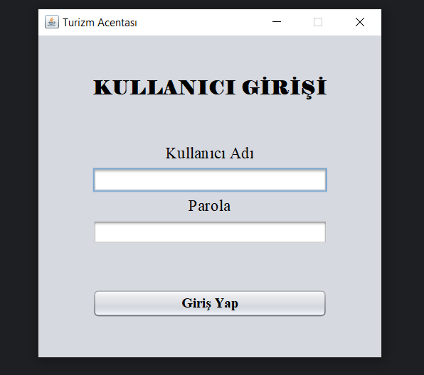
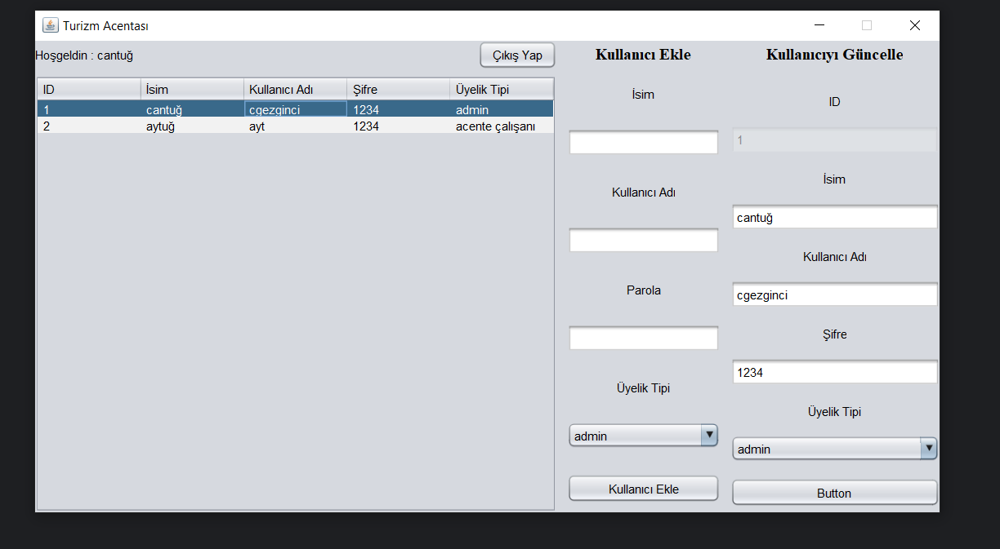
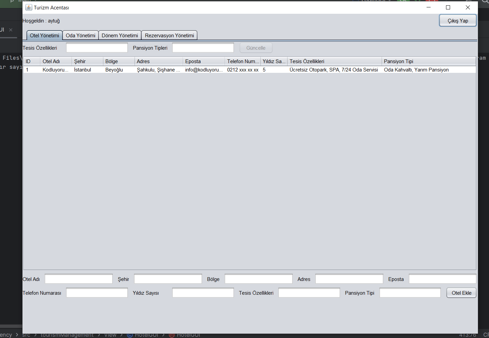
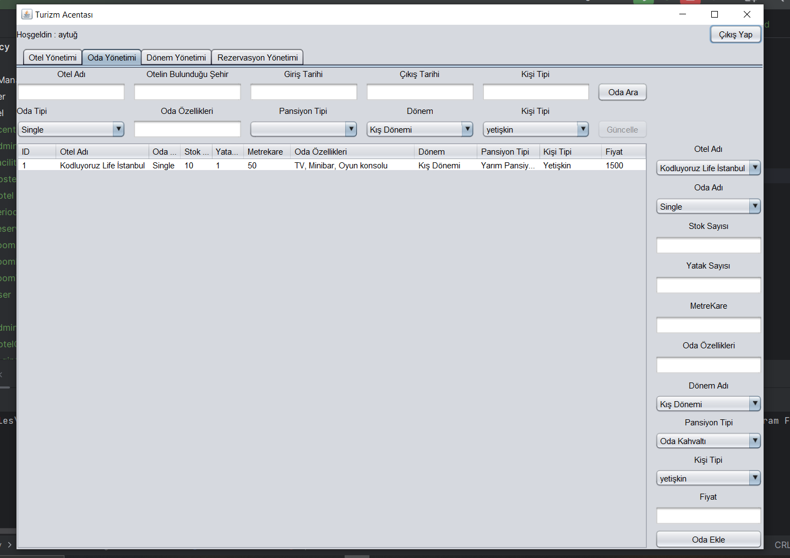
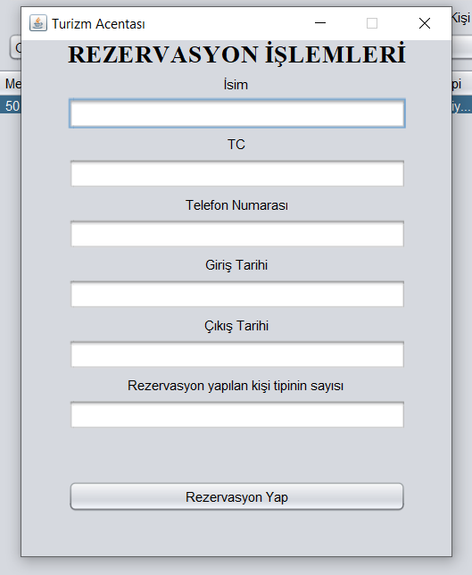
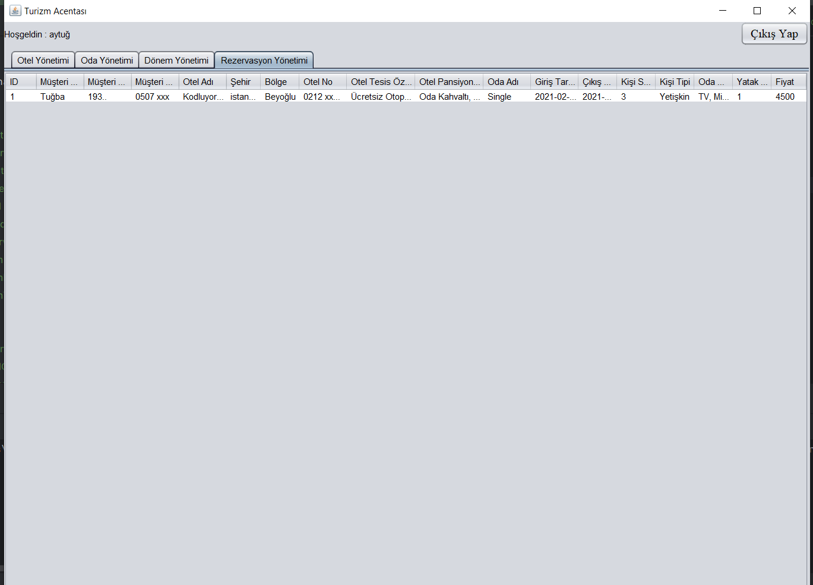
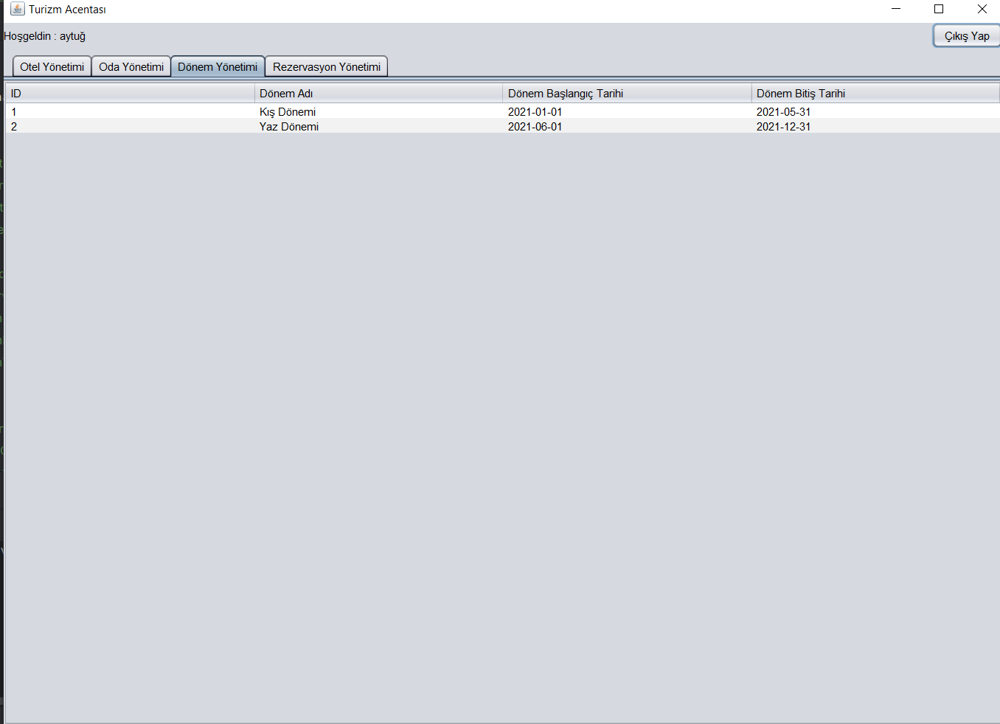

# Turizm Acentası Projesi

### Projemiz bir otel oda rezervasyon sistemini temel almaktadır.

* Proje ilk başlatıldığında karşımıza bir login ekranı gelmektedir. 

* Burada admin veya acenta çalışanı bilgilerini girerek yetkili ekranlarına ulaşabiliyoruz.

* Admin ekranında kullanıcı eklenebilir , güncellenebilir veya silinebilir.

* Acenta çalışanı girişi yapılırsa otel , oda , dönem ve rezervasyon yönetimi kısımları gelmektedir.

* Otel yönetimi kısmında acenta çalışanı otel ekleyebilir güncelleyebilir veya silebilir.

* Oda yönetiminde acenta çalışanı var olan otellerin pansiyonlarına göre oda ekleyebilir. Güncelleyebilir , oda araması yapabilir ve silebilir. Arama yapılırken stoğu 0 olan oda arama ekranında gösterilmez. Bunun yanında odaya sağ tıklayarak rezervasyon yapabilir. Rezervasyon stok sayısı 0 olan oda için yapılamaz. Rezervasyon yapılırsa stok sayısı azalır , rezervasyon iptal edilirse stok sayısı eski haline geri döner.

* Odaya sağ tıkladıktan sonra rezervasyon yap seçeneği seçilirse ekrana bu kısım gelir ve burada bilgiler girilerek rezervasyon işlemi gerçekleştirilir.

* Otel , oda ve fiyat bilgisi bu ekranda kullanıcı karşısına çıkar burada rezervasyon güncellenebilir veya silinebilir.

* Dönem yönetimi kısmında ise sistemin sahip olduğu dönemler gösterilmektedir. Ben 2 dönem tanımladım yaz ve kış olarak bu dönemler oda eklenirken seçilebilir ve oda yönetimi kısmında arama yaparken (yyyy-mm-dd) gösterilir.